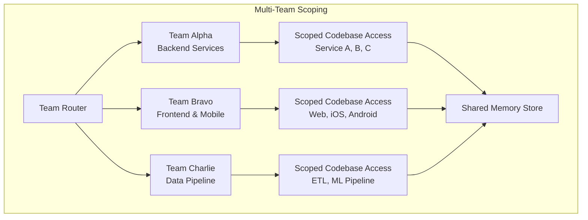

# Multi-Team Setup

SWE-Squad supports multiple engineering teams operating within a single organization. Each team gets its own isolated workspace with independent model preferences, governance rules, and codebase scope boundaries, while all teams share a common semantic memory store for cross-team learning.

## Overview

In a multi-team deployment, every squad operates as an independent unit with its own configuration, agent tuning, and escalation policies. A backend team handling Go microservices can run with strict governance and manual approval, while a frontend team shipping TypeScript may prefer auto-merge and faster polling intervals. Despite this isolation, the shared memory store ensures that lessons learned by one team benefit others encountering similar patterns.

The key primitives that make multi-team support work are:

- **Team Router** -- Directs incoming alerts to the correct team based on service ownership metadata.
- **SWE_TEAM_ID** -- A unique identifier that namespaces all ticket state, branch names, and persisted data per team.
- **Scoped Codebase Access** -- Agents operate within strictly defined file paths, preventing cross-team changes.
- **Shared Supabase Backend** -- All teams write to the same Supabase instance, with isolation enforced by `SWE_TEAM_ID`.
- **Dedicated GitHub Bots** -- Each team uses its own GitHub token and bot account for correct attribution and scope control.
- **Cross-Team Semantic Memory** -- Knowledge accumulated by any team is available to all teams through the shared memory store.

## Architecture

The following diagram illustrates how multiple teams route through a shared platform while maintaining scoped codebase access and a common memory store:



Each team receives alerts from the Team Router, operates within its own scoped codebase, and writes findings back to the shared memory store. The memory store is the single integration point across teams -- no team directly accesses another team's codebase or ticket state.

## Team Router

The Team Router is the entry point for all incoming alerts. It reads service ownership metadata attached to each alert and directs it to the correct team. This metadata typically comes from monitoring sources (PagerDuty, Datadog, GitHub) and includes the service name, repository, or error category.

Routing logic works as follows:

1. An alert arrives with metadata identifying the source service (for example, `backend-api`, `frontend-web`, or `data-pipeline`).
2. The Team Router matches the service against the configured team scopes in `swe_team.yaml`.
3. The alert is dispatched to the matching team's pipeline. If no match is found, the alert is routed to a default team or flagged for manual triage.
4. When an alert spans multiple services owned by different teams, the Router broadcasts it to all affected teams simultaneously (see [Cross-Team Incidents](#cross-team-incidents)).

This ensures that a backend timeout alert is handled by the backend team with the right model configuration and governance rules, while a frontend rendering error goes to the frontend team with its own settings.

## Configuring Teams

Each team requires two configuration files: a `swe_team.yaml` for structural and behavioral settings, and a `.env` file for secrets and runtime toggles. The following examples demonstrate a two-team setup sharing a single Supabase instance.

### Team A: backend-api

**swe_team.yaml:**

```yaml
version: 1

project:
  name: backend-api
  language: go
  repository: https://github.com/myorg/backend-api
  branch_prefix: swe-fix/backend-api/

monitor:
  sources:
    - github
    - pagerduty
  severity_filter:
    - critical
    - high
  labels:
    - incident

governance:
  require_approval: true
  auto_merge: false
  stability_gate: true
  test_threshold: 0.85
  rejection_limit: 2

agents:
  coder:
    max_tokens: 8192
    timeout: 240

integrations:
  pagerduty:
    api_key: pd-api-key-team-a
  slack:
    webhook_url: https://hooks.slack.com/services/T00/B00/team-a
```

**.env:**

```bash
ANTHROPIC_API_KEY=sk-ant-...
GITHUB_TOKEN=ghp_...
SUPABASE_URL=https://shared.supabase.co
SUPABASE_ANON_KEY=eyJ...
SWE_TEAM_ID=backend-api-team
```

Team A is configured for a Go backend service with strict governance: every PR requires manual approval, auto-merge is disabled, and the test threshold is set to 85%. The coder agent has an extended timeout of 240 seconds to accommodate longer compilation cycles.

### Team B: frontend-web

**swe_team.yaml:**

```yaml
version: 1

project:
  name: frontend-web
  language: typescript
  repository: https://github.com/myorg/frontend-web
  branch_prefix: swe-fix/frontend-web/

monitor:
  sources:
    - github
    - datadog
  poll_interval: 20
  severity_filter:
    - critical
    - high
    - medium

governance:
  require_approval: false
  auto_merge: true
  stability_gate: true
  test_threshold: 0.8
  max_file_changes: 25

agents:
  explorer:
    max_tokens: 4096
  reviewer:
    model: opus
    max_tokens: 8192

integrations:
  datadog:
    api_key: dd-api-key-team-b
    app_key: dd-app-key-team-b
  slack:
    webhook_url: https://hooks.slack.com/services/T00/B00/team-b
```

**.env:**

```bash
ANTHROPIC_API_KEY=sk-ant-...
GITHUB_TOKEN=ghp_...
SUPABASE_URL=https://shared.supabase.co
SUPABASE_ANON_KEY=eyJ...
SWE_TEAM_ID=frontend-web-team
```

Team B operates a TypeScript frontend with lighter governance: auto-merge is enabled, approval is not required, and the severity filter includes medium-priority issues. The reviewer agent is upgraded to Opus for thorough code review of UI changes.

## Shared Supabase Backend

All teams in a multi-team deployment write to the same Supabase instance. The `SUPABASE_URL` and `SUPABASE_ANON_KEY` are identical across teams, while the `SWE_TEAM_ID` differentiates each team's data:

| Variable | Team A | Team B |
|----------|--------|--------|
| `SUPABASE_URL` | `https://shared.supabase.co` | `https://shared.supabase.co` |
| `SUPABASE_ANON_KEY` | `eyJ...` | `eyJ...` |
| `SWE_TEAM_ID` | `backend-api-team` | `frontend-web-team` |

This shared backend simplifies infrastructure management -- you provision and maintain a single Supabase project rather than one per team. The database schema uses `SWE_TEAM_ID` as a partition key on all ticket and state tables, so queries are automatically scoped to the requesting team.

## Ticket Isolation

The `SWE_TEAM_ID` environment variable is the primary isolation mechanism between teams. Every ticket, branch, and persisted state entry is namespaced with this identifier:

- **Ticket queries** include a `WHERE team_id = ?` filter, so each team only sees and operates on its own tickets.
- **Branch names** are prefixed with the team's `branch_prefix` (for example, `swe-fix/backend-api/ticket-abc123`), preventing naming collisions.
- **State transitions** (New, Triaged, Investigating, In Development, In Review, Deployed) are tracked per team, so one team's pipeline never interferes with another's.

This means Team Alpha can have a ticket in the In Review state while Team Bravo processes a separate ticket through Triage, and neither team's operations affect the other's state.

## Dedicated GitHub Bot Accounts

Each team should use its own GitHub bot account and personal access token. This provides three benefits:

1. **Correct attribution** -- PRs and comments show the team's bot identity rather than a shared generic account, making it clear which team's automation created a change.
2. **Scope isolation** -- Each token is scoped to only the repositories that team manages, preventing accidental access to another team's codebase.
3. **Rate limit independence** -- Each token has its own API rate limit budget, so a high-activity team does not throttle another team's automation.

Configuration is straightforward. Each team sets its own `GITHUB_TOKEN` in its `.env` file:

```bash
# Team A .env
GITHUB_TOKEN=ghp_backend-bot-token

# Team B .env
GITHUB_TOKEN=ghp_frontend-bot-token
```

When creating the bot accounts, restrict each token's scope to the repositories owned by that team. For example, the backend bot token should only have access to `myorg/backend-api` and related service repos, while the frontend bot token should only access `myorg/frontend-web` and its dependencies.

## Scoped Codebase Access

Within each team, agents operate within strictly scoped codebase boundaries defined by the `scope` configuration. A backend agent cannot access frontend repositories and vice versa. This prevents accidental cross-team changes and keeps each team's context window focused on relevant code.

Define scopes in the `teams` section of your configuration:

```yaml
teams:
  - name: platform
    models: { triage: haiku, fix: sonnet }
    scope: ["src/core", "src/api"]
  - name: frontend
    models: { triage: haiku, fix: haiku }
    scope: ["src/web", "src/components"]
```

In this example, the platform team's agents can only read and modify files under `src/core` and `src/api`. The frontend team's agents are restricted to `src/web` and `src/components`. Any file path outside the configured scope is inaccessible to that team's agents.

Scope enforcement applies at the file-read and file-write level. An agent that attempts to read a file outside its scope receives an access-denied response, and write attempts to out-of-scope paths are rejected before execution. This is a hard boundary -- there is no override or bypass mechanism.

## Cross-Team Semantic Memory

Despite scoped codebases, the semantic memory store is shared across all teams. When one team resolves a novel issue, the Distiller Agent extracts the key findings and writes them to the shared memory. Any team that later encounters a similar pattern can retrieve that knowledge, even if the original issue was in a different service or language.

This creates a compounding knowledge effect:

- A backend team's fix for a database connection leak teaches the data pipeline team about connection pooling patterns.
- A frontend team's resolution of a race condition informs the mobile team about async state management.
- Over time, the shared memory reduces duplicate investigations across the organization.

The memory store uses semantic similarity matching, not exact string matching. This means lessons are transferred based on conceptual similarity rather than identical error messages, making cross-team knowledge transfer effective even when teams use different languages, frameworks, or error formats.

## Cross-Team Incidents

Some incidents span multiple teams. A common example is an API change in a backend service that breaks a frontend consumer. The Team Router handles these cases by detecting overlap in the alert's affected services and broadcasting the incident to all relevant teams simultaneously.

The cross-team incident flow works as follows:

1. The Team Router receives an alert that references services owned by multiple teams (for example, both `backend-api` and `frontend-web`).
2. The Router creates a separate ticket in each affected team's namespace, linked by a shared incident correlation ID.
3. Each team investigates the incident within its own scoped codebase, using its own model configuration and governance rules.
4. As each team posts findings to the shared memory store, other teams working the same incident can access the accumulated context.
5. When one team's fix resolves the root cause, the correlated tickets in other teams are automatically updated with the resolution context, allowing them to verify the fix on their side.

This broadcast-and-correlate approach ensures that cross-team incidents are handled in parallel rather than sequentially. The frontend team does not wait for the backend team to finish before starting its investigation -- both work concurrently, sharing context through the memory store as they go.
