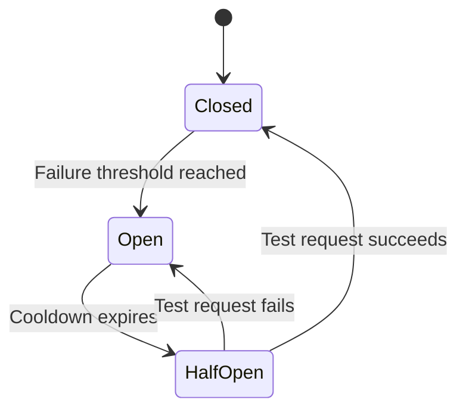

# Security and RBAC

SWE-Squad operates autonomous agents that can read code, write patches, and create pull requests. Because these agents have real write access to production repositories, security boundaries and access controls are critical. This guide covers every layer of the security model: bot containment, credential scoping, role-based access control, circuit breakers, governance controls, and audit trails.

## Overview

The SWE-Squad security architecture is built on the principle of least privilege. Every component -- from the container runtime to the API tokens to the agent decorators -- is designed to minimize the blast radius of a misbehaving or compromised agent. The system enforces isolation at four levels:

1. **Runtime isolation** -- Agents run in sandboxed containers or VMs, never on bare metal.
2. **Credential isolation** -- Each team uses its own set of API keys and tokens.
3. **Permission isolation** -- RBAC middleware ensures agents and users can only perform actions their role permits.
4. **Operational isolation** -- Governance controls and circuit breakers prevent runaway or cascading failures.

Together, these layers ensure that even if a single agent is compromised or produces an incorrect result, the damage is contained and auditable.

## Bot Containment Policy

All SWE-Squad agents must run in a sandboxed VM or container environment. Never run bots directly on production infrastructure. The containment policy is enforced by the `SWE_DOCKER_ENABLED` environment variable and the `@require_sandbox` decorator.

**Key policies:**

- **Run in Docker containers or VMs only.** Agent tool calls (file reads, file writes, shell execution) are executed inside a sandboxed runtime when `SWE_DOCKER_ENABLED=true`.
- **No direct access to production databases.** Agents interact with production state exclusively through the Supabase API, which enforces row-level security policies.
- **Network egress restricted to required APIs.** The container firewall allows outbound connections only to GitHub, Anthropic, and Supabase endpoints. All other egress is denied.
- **Filesystem access scoped to the repository checkout.** Agents can only read and write files within the cloned repository directory. Access to host filesystem paths outside the checkout is blocked.
- **Container resource limits prevent runaway processes.** CPU and memory limits are applied to every agent container. A misbehaving agent that consumes excessive resources is killed by the runtime before it impacts other agents or the host.

To enable container sandboxing, set the environment variable:

```bash
SWE_DOCKER_ENABLED=true
```

This is the recommended setting for all production deployments. In development, you may set `SWE_DOCKER_ENABLED=false` for faster iteration, but be aware that agents will execute tool calls directly on the host.

## Credential Scoping

Each team uses its own set of credentials, preventing privilege escalation across teams. A compromised token for one team cannot be used to access another team's repositories, tickets, or billing.

### Credential Scoping Table

| Credential | Scope | Purpose |
|---|---|---|
| `ANTHROPIC_API_KEY` | Per team | LLM inference billing isolation. Each team pays for its own model usage. |
| `GITHUB_TOKEN` | Per team (dedicated bot account) | Repository access and PR creation. Scopes limited to `repo` and `read:org`. |
| `SUPABASE_ANON_KEY` | Shared across teams | Client-side API access. Row-level security (RLS) policies enforce ticket isolation per `SWE_TEAM_ID`. |
| `SWE_WEBHOOK_SECRET` | Per team | Webhook payload verification. Prevents cross-team webhook injection. |

### Token Management

- **Tokens are stored in `.env` files, never committed to version control.** Add `.env` to your `.gitignore` before the first commit.
- **GitHub token scopes should be minimal.** Only `repo` (for branch creation and PR management) and `read:org` (for team membership lookups) are required. Do not grant `admin:org`, `delete_repo`, or other broad scopes.
- **Rotate credentials on a regular schedule.** Set a calendar reminder to rotate API keys and tokens at least every 90 days. When a team member leaves, revoke their tokens immediately.

### Example `.env` per Team

```bash
# Team: backend-api
ANTHROPIC_API_KEY=sk-ant-api03-...
GITHUB_TOKEN=ghp_backendBot...
SUPABASE_URL=https://shared.supabase.co
SUPABASE_ANON_KEY=eyJhbGciOi...
SWE_TEAM_ID=backend-api-team
SWE_WEBHOOK_SECRET=whsec_backend_...
```

```bash
# Team: frontend-web
ANTHROPIC_API_KEY=sk-ant-api03-...
GITHUB_TOKEN=ghp_frontendBot...
SUPABASE_URL=https://shared.supabase.co
SUPABASE_ANON_KEY=eyJhbGciOi...
SWE_TEAM_ID=frontend-web-team
SWE_WEBHOOK_SECRET=whsec_frontend_...
```

Both teams share the same `SUPABASE_URL` and `SUPABASE_ANON_KEY`, but RLS policies ensure that Team A cannot read or modify Team B's tickets.

## RBAC Middleware

SWE-Squad enforces role-based access control through middleware decorators in the `swe_team.rbac` module. These decorators check the calling agent or user's permission level before allowing execution.

### Roles

| Role | Permissions |
|---|---|
| **Viewer** | View incidents and reports |
| **Operator** | View + Apply fixes + Manage alerts |
| **Admin** | Full access + Configuration + Deploy |
| **Auditor** | View all + Audit logs + Compliance |

Roles are hierarchical: Admin inherits all Operator and Viewer permissions. Auditor is a cross-cutting role that can read all data and audit logs but cannot modify incidents or deploy fixes.

### Decorators

- **`@require_permission(role)`** -- Checks that the caller has at least the required permission level. Raises `PermissionDenied` if the check fails.
- **`@require_sandbox`** -- Enforces that the operation must run within a sandboxed environment. Raises `SandboxRequired` if `SWE_DOCKER_ENABLED` is `false` or the sandbox check fails.

### Code Example

```python
from swe_team.rbac import require_permission, require_sandbox

@require_permission("admin")
@require_sandbox
async def deploy_fix(ticket_id: str, patch: str):
    """Deploy a validated fix -- requires admin role and sandbox environment."""
    ...

@require_permission("operator")
async def apply_fix(ticket_id: str):
    """Apply a generated fix -- operators and above."""
    ...
```

Decorators are composable. Stack `@require_sandbox` with `@require_permission` to enforce both constraints on the same function.

## Circuit Breaker

The circuit breaker pattern prevents cascading failures when an upstream service or agent operation becomes unreliable. SWE-Squad implements circuit breakers around all external calls: API requests, model inference, and tool execution.

### How It Works

1. **Closed state (normal operation).** All calls pass through. The breaker counts consecutive failures.
2. **Open state (tripped).** When the failure count reaches the configured threshold (default: 5), the circuit opens. All subsequent calls are short-circuited and return immediately with an error, preventing wasted time and resources.
3. **Half-open state (probing).** After a cooldown period (default: 60 seconds), the circuit transitions to half-open. A single test request is allowed through.
4. **Recovery or re-trip.** If the test request succeeds, the circuit closes and normal operation resumes. If the test request fails, the circuit reopens and the cooldown restarts.

### State Diagram



### Configuration

Add the `circuit_breaker` section to your `swe_team.yaml`:

```yaml
circuit_breaker:
  failure_threshold: 5
  cooldown_seconds: 60
  half_open_max_calls: 1
```

| Key | Type | Default | Description |
|---|---|---|---|
| `circuit_breaker.failure_threshold` | number | `5` | Consecutive failures required to trip the circuit. |
| `circuit_breaker.cooldown_seconds` | number | `60` | Seconds to wait in the open state before transitioning to half-open. |
| `circuit_breaker.half_open_max_calls` | number | `1` | Number of test requests allowed in the half-open state. |

Circuit breakers are applied per service. If the GitHub API trips its breaker, the Anthropic API and Supabase API continue operating normally. This isolates failures to the affected dependency.

## Governance Controls

The `governance` section in `swe_team.yaml` controls the guardrails that determine whether a fix is allowed to merge, requires human review, or is blocked outright. These controls are the last line of defense before code reaches production.

### Governance Configuration Table

| Key | Type | Default | Description |
|---|---|---|---|
| `governance.require_approval` | boolean | `false` | Whether human approval is required before merging fixes. |
| `governance.auto_merge` | boolean | `false` | Whether to automatically merge fixes that pass the stability gate. |
| `governance.stability_gate` | boolean | `true` | Enable or disable the full validation suite (tests, lint, type check, security scan). |
| `governance.test_threshold` | number | `0.8` | Minimum test pass rate (0.0--1.0) required to allow merge. |
| `governance.max_file_changes` | number | `20` | Maximum number of files a fix can modify. PRs exceeding this are blocked. |
| `governance.max_line_changes` | number | `500` | Maximum number of lines a fix can change. PRs exceeding this are blocked. |
| `governance.rejection_limit` | number | `3` | Number of review rejections before the incident is escalated to a human. |

### Development vs. Production

Governance settings should differ between environments. Development favors speed and iteration; production favors safety and control.

**Development configuration:**

```yaml
governance:
  require_approval: false
  auto_merge: true
  stability_gate: true
  test_threshold: 0.7
  max_file_changes: 30
  max_line_changes: 1000
  rejection_limit: 5
```

**Production configuration:**

```yaml
governance:
  require_approval: true
  auto_merge: false
  stability_gate: true
  test_threshold: 0.95
  max_file_changes: 10
  max_line_changes: 200
  rejection_limit: 2
```

In production, every fix requires explicit human approval (`require_approval: true`), auto-merge is disabled, the test threshold is set to 95%, and the change limits are tight. A fix that modifies more than 10 files or 200 lines is automatically blocked for manual review.

## Audit Trail via Supabase Events

Every significant action in SWE-Squad is logged as an event in the Supabase `audit_events` table. This provides a complete, tamper-evident record of what the system did, when, and on whose behalf.

### Logged Event Types

- **Ticket state transitions** -- New, Triaged, Investigating, In Development, In Review, Deployed
- **Fix submissions and review outcomes** -- Patch generated, review passed, review rejected
- **Governance decisions** -- Approvals, rejections, escalations to human reviewers
- **RBAC permission checks** -- Granted and denied permission checks, with the requesting role and target operation
- **Circuit breaker state changes** -- Circuit opened, closed, or transitioned to half-open
- **Agent actions** -- Tool calls (file reads, file writes, shell execution), PR creation, branch operations

### Querying Audit Events

Events are queryable via the Supabase Dashboard or the Supabase REST API. The following SQL query retrieves the last 7 days of audit events for a specific team:

```sql
SELECT event_type, agent_id, ticket_id, metadata, created_at
FROM audit_events
WHERE team_id = 'backend-api-team'
  AND created_at > NOW() - INTERVAL '7 days'
ORDER BY created_at DESC;
```

To filter for a specific event type, add a condition:

```sql
SELECT event_type, agent_id, ticket_id, metadata, created_at
FROM audit_events
WHERE team_id = 'backend-api-team'
  AND event_type = 'permission_denied'
  AND created_at > NOW() - INTERVAL '7 days'
ORDER BY created_at DESC;
```

Audit events are retained indefinitely by default. Set a retention policy via Supabase RLS or a scheduled function if your organization requires data lifecycle management.

## Best Practices

Follow this checklist to maintain a secure SWE-Squad deployment:

- Always run agents in containers or VMs. Set `SWE_DOCKER_ENABLED=true` in production.
- Use dedicated GitHub bot accounts per team. Never share bot tokens across teams.
- Scope API keys to the minimum required permissions. Grant only `repo` and `read:org` scopes on GitHub tokens.
- Enable governance controls in production. Set `require_approval: true` to enforce human review before merge.
- Set `stability_gate: true` and a high `test_threshold` (0.9 or above) in production.
- Use `max_file_changes` and `max_line_changes` to limit blast radius. Start with conservative limits and relax them only when justified.
- Enable circuit breakers to prevent cascading failures. Tune `failure_threshold` and `cooldown_seconds` based on your upstream service reliability.
- Regularly review audit logs in Supabase. Set up automated alerts for `permission_denied` and `circuit_open` events.
- Rotate credentials on a regular schedule. Replace API keys and tokens at least every 90 days, and immediately after any team member with access leaves the organization.
